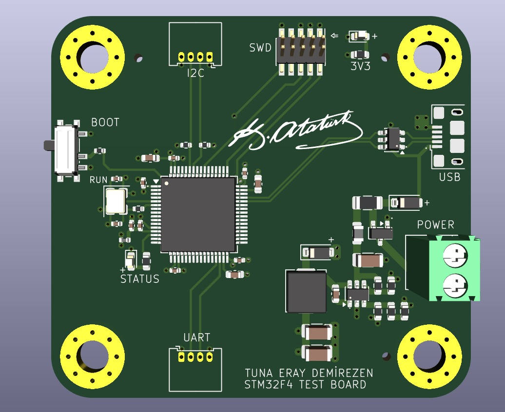
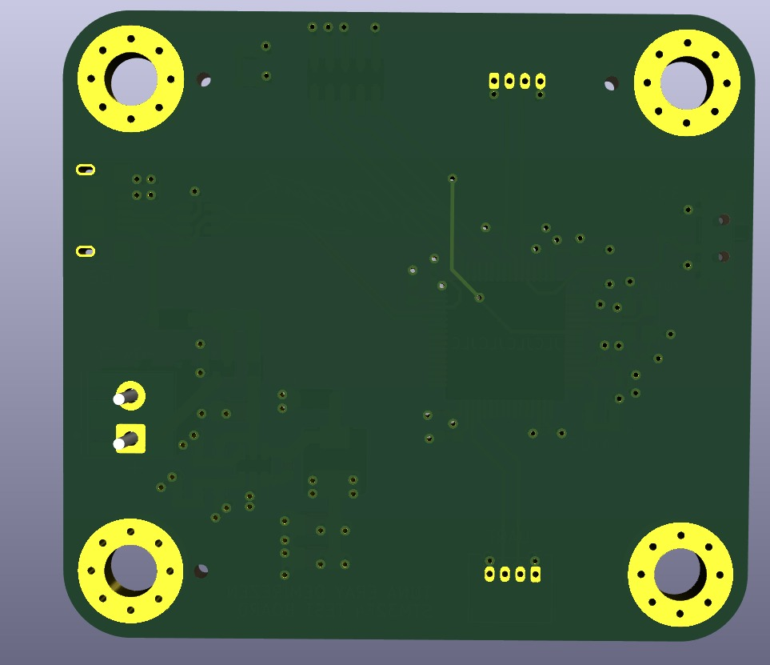

# STM32F405RGT6 Test Board Hardware Design

A custom-designed embedded development and test board based on the **STM32F405RGT6** microcontroller.
This project focuses on creating a reliable, protected, and programmable STM32-based hardware platform with multiple communication interfaces and a robust power architecture.

## Overview

The board was designed as a programmable STM32F405RGT6-based embedded development platform. It includes common communication interfaces such as **UART**, **I2C**, and **USB**, along with power input protection and programming support.

The hardware design also includes protection mechanisms for safer operation, such as reverse polarity protection, overcurrent protection, and USB ESD protection.

## Features

* STM32F405RGT6 microcontroller
* UART communication interface
* I2C communication interface
* USB interface
* SWD programming support
* External 16 MHz clock circuit
* 12V external power input support
* USB 5V power input support
* Reverse polarity protection
* Overcurrent protection
* USB ESD protection
* Buck converter-based power stage
* 4-layer PCB design
* Signal integrity and power integrity considerations

## Hardware Design

The board includes two different power input paths:

* **12V external input**
* **USB 5V input**

Both input paths were designed with protection in mind. The external power input includes reverse polarity and overcurrent protection, while the USB line includes ESD protection to improve reliability during development and testing.

A buck converter-based power stage is used to generate a safe and stable voltage level for the STM32 microcontroller and peripheral circuits.

## PCB Design

The PCB was designed as a **4-layer board** to improve routing quality, power distribution, and signal integrity.
The layout was created by considering:

* Power integrity
* Signal integrity
* Proper decoupling
* Short and clean clock routing
* Stable MCU power delivery
* USB and communication line protection

## Images

### PCB Front

### PCB Back

## Project Purpose

The main purpose of this project is to create a reliable STM32F405RGT6-based test and development board that can be used for embedded software development, peripheral testing, and hardware validation.

## Technologies Used

* STM32F405RGT6
* KiCad
* 4-layer PCB design
* Buck converter power stage
* UART
* I2C
* USB
* SWD programming interface

## Status

Hardware design completed and PCB files prepared for production.
